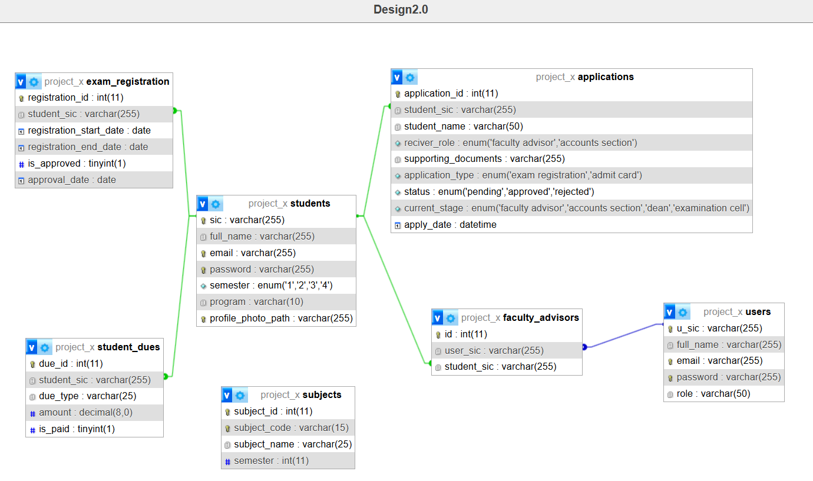

# Digital Exam Registration And Admit Card Download System

It is a group project that elements physical presence of a student for exam registration and admit card download.

## Tech Stack Used In This Project

- HTML
- CSS
- JavaScript
- PHP
- Bootstrap

## Database Model

- [Project models link](https://app.eraser.io/workspace/674WPbnQsyz28av6XtcB?origin=share)

## Installation
1. Fork the project
2. Clone the project
3. Open XAMPP server and start Apache
4. Open chrome with the URl: [Project URL](http://localhost/php_projects/project_x/dashboard.php)

## Contributors

- [Subhasis sahoo](https://github.com/subhasis-sahoo)
- [Ranjeet Parida](https://github.com/RanjeetParida)
- [Smurti Ranjan Behera](https://github.com/smruti030)